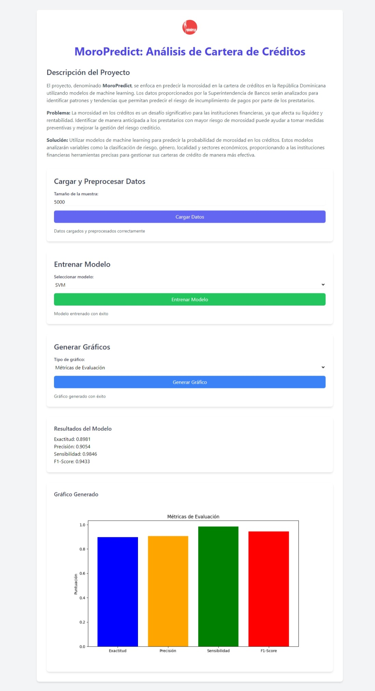
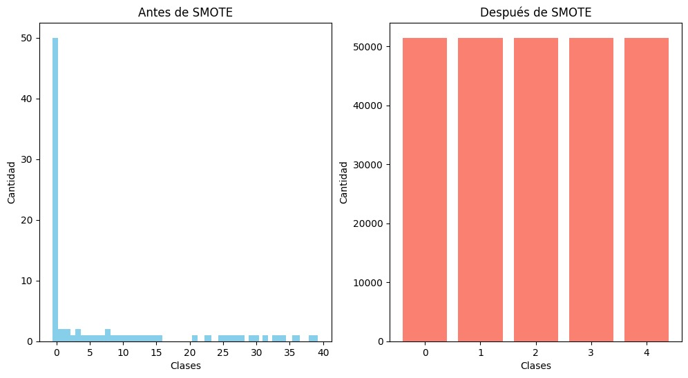
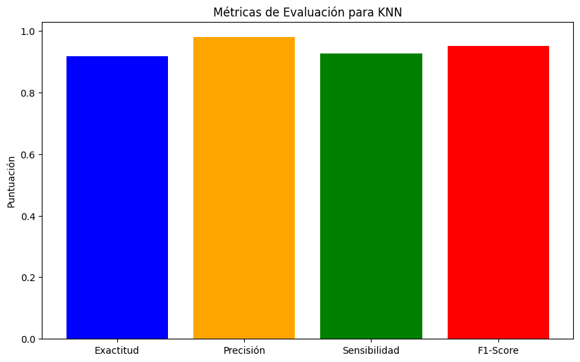
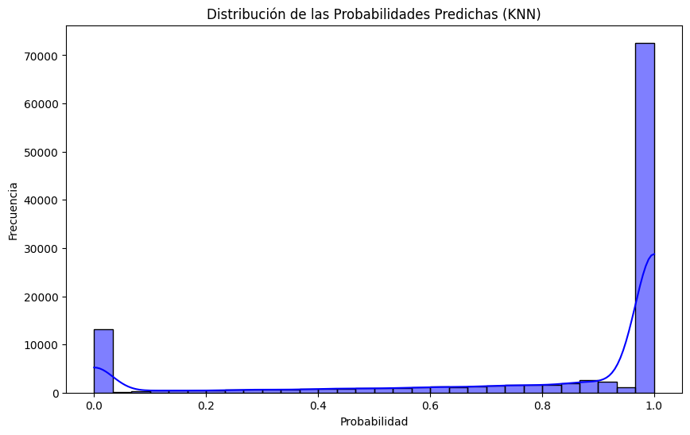
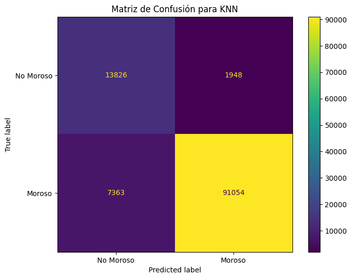

# MoroPredict: Predicción de Morosidad en Carteras de Crédito

## Breve descripción del proyecto:

MoroPredict utiliza modelos de machine learning para analizar datos de la Superintendencia de Bancos de la República Dominicana y predecir la morosidad en carteras de crédito. Esto permite a las instituciones financieras identificar a tiempo a los prestatarios con mayor riesgo y tomar decisiones más informadas.

## Arquitectura del proyecto:

Carga y preprocesamiento de datos: Lee, limpia y transforma datos de diferentes fuentes.
Modelos de Machine Learning: Entrenar y evaluar múltiples modelos (Red Neuronal, SVM, KNN, Random Forest).
Selección del mejor modelo: Comparación y selección del modelo con mejor rendimiento.
Interfaz de usuario (Flask): Visualización de resultados y gráficos interactivos.
Proceso de desarrollo:

Fuente del dataset: Superintendencia de Bancos de la República Dominicana.

Limpieza de datos:

Eliminación de duplicados.
Imputación de valores faltantes. 
Manejo de excepciones/control de errores:

Implementación de mecanismos para detectar y manejar datos inválidos o errores en el proceso.
Registro de eventos y errores para facilitar la depuración.
Modelo(s) de Machine Learning:

Red Neuronal (Perceptrón multicapa)
Máquina de Soporte Vectorial (SVM)
K-Vecinos más Cercanos (KNN)
Bosque Aleatorio (Random Forest)
Estadísticos (Valores, gráficos):

Métrica(s) de evaluación del modelo:

Exactitud (Accuracy)
Precisión (Precision)
Sensibilidad (Recall)
Puntuación F1 (F1-Score)
Curva ROC
Curva Precisión-Recall

## Integrantes del Equipo y Roles
###  Milton García
Papel: Cargar los datos en Pandas DataFrames. Asegurarse de que los datos estén correctamente importados y estructurados para su análisis posterior. Verificar la coherencia y calidad de los datos, especialmente en términos de captaciones y créditos por localidad y género.
Explorar los datos para determinar el formato y los atributos necesarios. Evaluar el comportamiento de las captaciones y créditos en diferentes localidades y entre diferentes géneros a lo largo del tiempo, identificando patrones de crecimiento y decrecimiento.

### Erick Cuesto
Papel: Crear visualizaciones efectivas para representar los datos de inclusión financiera. Graficar captaciones, créditos y operaciones de subagentes bancarios en diferentes localidades, utilizando subplots para comparar múltiples métricas en una sola figura.

### Sebastián Espinal
Papel: Realizar el preprocesado de datos. Identificar y corregir valores faltantes o nulos, asegurándose de que todos los datos estén en el formato correcto para el análisis. Normalizar y estandarizar los datos según sea necesario.

### Madeline Pérez
Papel: Analizar y evaluar las métricas clave de inclusión financiera. Determinar las localidades con mayor y menor acceso a servicios financieros, así como identificar diferencias significativas entre géneros. Evaluar y comparar las métricas de inclusión financiera para hacer recomendaciones específicas.
### TODO EL EQUIPO - Modelado y Análisis Avanzado con IA
Papel: Implementar técnicas de inteligencia artificial para realizar un análisis avanzado de los datos. Utilizar algoritmos de clustering para segmentar localidades según su nivel de inclusión financiera, y técnicas de regresión para identificar factores clave que afectan la inclusión financiera. Desarrollar modelos predictivos para proponer intervenciones específicas.

Tecnología y Herramientas Utilizadas
Lenguaje de Programación: Python
Bibliotecas: Pandas, NumPy, Scikit-learn, Matplotlib, Seaborn
Frameworks: TensorFlow (para análisis avanzado de IA) y Flask
Herramientas de Visualización: Matplotlib, Seaborn
Plataforma de Desarrollo: Jupyter Notebook
